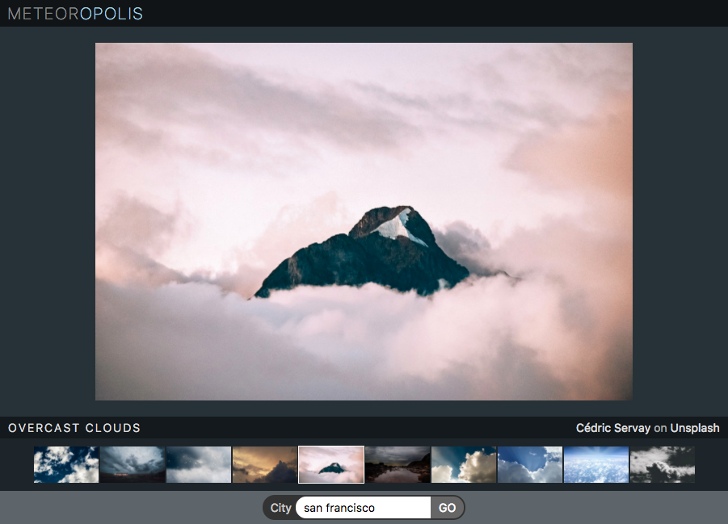

# Mini-weather... React edition

## Set-up

- Run `npm install` to download dependencies

- To build project run `npm run dev` or `npm run dev -- --watch` to build continuously in the background.

- Use API keys generated for Mini Weather App to query OpenWeatherMap and Unsplash APIs.

- Inserted the main photo into the element with the id `photos` and thumbnails into the element with id `thumbs`.

## Objectives

- [ ] Use `fetch` to retrieve the weather for a single day. You can see the documentation at [https://openweathermap.org/current](https://openweathermap.org/current). Have set London as the default. Used the React lifecycle method `componentDidMount` to run the initial `fetch`.

- [ ] On retrieving the weather data, used its `description` property to get matching images from Unsplash. Documentation for image search at [https://unsplash.com/documentation#search-photos](https://unsplash.com/documentation#search-photos).

- [ ] Display the images as a gallery of clickable thumbnails. When a thumbnail is clicked, should display that image as the main image.

## Stretch goals

- [ ] Use the `Search` component to display what the weather is like in other cities

- [ ] Display photographer credits in `Info` component with link to their portfolio on Unsplash

- [ ] Display white border around thumbnail of image currently displayed as main image using `active` class
